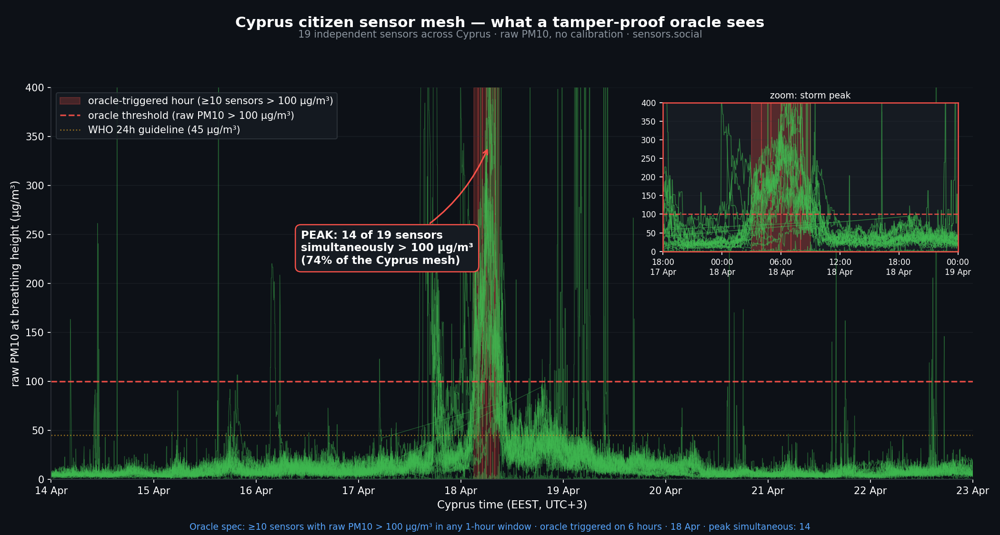

# Tamper-Proof Weather Oracle

A citizen-owned, geographically distributed atmospheric oracle for prediction markets — currently running over Cyprus on the [sensors.social](https://sensors.social) mesh, with on-chain attestation roadmap on [Robonomics](https://robonomics.network).



---

## Why

On April 6 and 15, 2026, [Polymarket paid out ~$34,000](https://www.tradingview.com/news/cointelegraph:1c00dcc26094b:0-polymarket-traders-win-37k-after-paris-weather-data-glitch-raising-suspicion/) to traders who correctly bet on Paris temperature spikes. The spikes turned out to be physical sensor tampering — a heating device placed near a single weather station at Charles de Gaulle Airport. Météo France filed criminal charges under Article 323-2 of the French Penal Code.

The bug isn't Polymarket. It's any prediction market that resolves on a single sensor.

This repository specifies — and demonstrates with live data — an alternative.

## What

A trigger rule that resolves a market YES iff **≥10 distinct qualified sensors** in the Cyprus mesh each report **raw PM10 > 100 µg/m³** within the same 1-hour window.

To force a YES dishonestly, an attacker would need simultaneous physical access to 10+ devices owned by 10+ operators across a 240 km island. To force a NO, they would need to suppress real readings on more than 9 devices through every dust event for 14 days.

Full resolution rules, sensor qualification criteria, and audit procedure: [`spec.md`](spec.md).

## Live demonstration

Re-running the trigger rule across April 14–22, 2026:

| Storm | Window | Triggered hours | Peak simultaneous sensors |
|---|---|---|---|
| Storm 1 | 14–16 Apr | 0 | 7 |
| Storm 2 | 17–19 Apr | 6 (all 18 Apr) | **14 (74% of pool)** |

A live prediction market resolving on this oracle: *Will the Robonomics-powered citizen sensor mesh detect another dust storm over Cyprus in the next 14 days?* — **[Manifold market](https://manifold.markets/SergeiLonshakov/will-the-robonomicspowered-citizen)**

### Status updates

- **[2026-05-02 — day 9 of 14](updates/2026-05-02.md)** — 22 sensors active, 0 triggered hours, peak simultaneous = 2. Network calm. 5 days remaining.
- **[2026-04-26 — day 3 of 14](updates/2026-04-26.md)** — 21 sensors active, 0 triggered hours, peak simultaneous = 2. Network calm.

## Reproduce the chart

The script that produced `chart.png` is in [`scripts/chart_oracle_proof.py`](scripts/chart_oracle_proof.py). It currently reads from the sensors.social MongoDB on the Robonomics collator (`84.32.186.165`) over SSH; a public read-only API is on the roadmap (see spec).

```bash
python3 scripts/chart_oracle_proof.py
```

## Open invitation to integrate

Any prediction market platform — Polymarket, Azuro, Limitless, Manifold, Kalshi — can resolve weather or air-quality markets on this oracle today. The spec is public, the data source is public, the rule is independently re-derivable.

UMA, Chainlink, Pyth: this is exactly the class of off-chain assertion you specialize in. Reach out.

## Links

- Network: [sensors.social](https://sensors.social)
- Infrastructure: [Robonomics](https://robonomics.network) on Polkadot
- Source incident: [Cointelegraph coverage](https://www.tradingview.com/news/cointelegraph:1c00dcc26094b:0-polymarket-traders-win-37k-after-paris-weather-data-glitch-raising-suspicion/)

## License

MIT. See [LICENSE](LICENSE).
