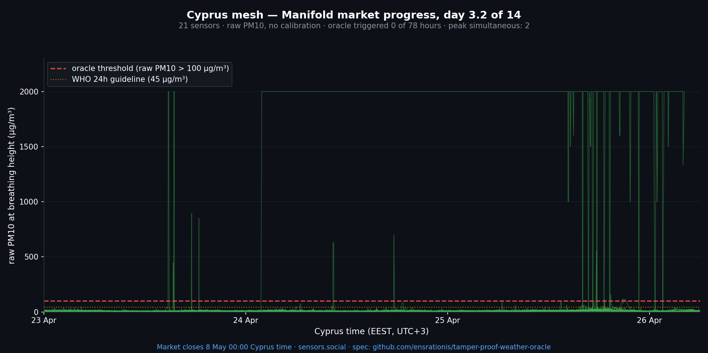

# Day 3 of 14 — status update

*2026-04-26 · live demo market: <https://manifold.markets/SergeiLonshakov/will-the-robonomicspowered-citizen>*

## Numbers

- **Cyprus mesh active sensors**: 21 (was 19 at market open — two new devices joined the qualified pool)
- **Oracle-triggered hours so far**: 0
- **Peak simultaneous over-threshold (>100 µg/m³)**: 2 of 21 sensors — far below the quorum of 10
- **Days elapsed**: 3 of 14 · **days remaining**: 11

The network is calm. No part of the island has produced anything close to the basin-wide event the oracle is built to recognise.

## What we shipped this week

- **Weekly weekend air-check publication** — Saturday 14:00 local snapshot for Limassol, Tashkent, and Togliatti, dual-panel (top: CAMS satellite haze past + forecast; bottom: live ground sensors). Posts published on @SensorsSocial: [Limassol](https://x.com/SensorsSocial/status/2048014995569467600) · [Tashkent](https://x.com/SensorsSocial/status/2048015011910500501) · [Togliatti](https://x.com/SensorsSocial/status/2048015028763189494).
- **CAMS PM10 forecast snapshots** — committed under `data/forecasts/` of the operator's working repo so we can compute CAMS-vs-ground accuracy week over week. Directly relevant to whether a satellite indicator could pre-warn this market.

## CAMS 24h-ahead, Cyprus surface PM10

Forecast envelope: ~20–24 µg/m³ — sustained spring haze, well below dust-event level.

## Reference

| Storm | Window | Triggered hours | Peak simultaneous |
|---|---|---|---|
| Storm 1 | 14–16 Apr | 0 | 7 |
| Storm 2 | 17–19 Apr | 6 (all 18 Apr) | 14 (74 % of pool) |

The oracle clearly discriminates between local dust and basin-wide events. So far in the market window, neither has appeared.

Spec: [`spec.md`](../spec.md). Chart script in the operator working repo: [`scripts/chart_market_period_cyprus.py`](https://github.com/ensrationis/altruist_and_sensors.social).
