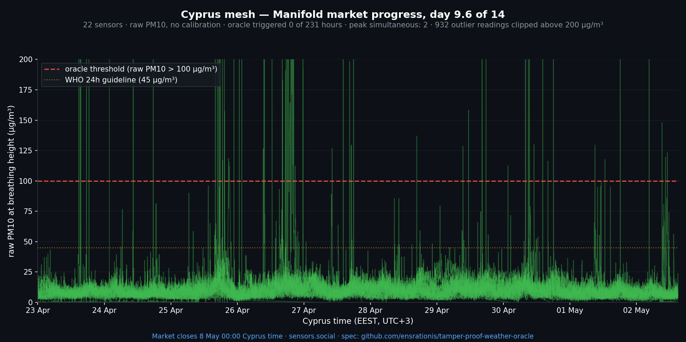

# Day 9 of 14 — status update

*2026-05-02 · live demo market: <https://manifold.markets/SergeiLonshakov/will-the-robonomicspowered-citizen>*

## Numbers

- **Cyprus mesh active sensors**: 22 (was 19 at market open — three new devices joined the qualified pool over the window)
- **Oracle-triggered hours so far**: 0
- **Peak simultaneous over-threshold (>100 µg/m³)**: 2 of 22 sensors — far below the quorum of 10
- **Days elapsed**: 9 of 14 · **days remaining**: 5

The network is calm. No basin-wide event has occurred since market open. A single sensor in Limassol (`4DjaKwvFCG…`) is the noisiest in the cluster (24 h avg 15.7, max ~390) — a known local outlier rather than a signal of any wider dust influx.

## Limassol live snapshot (last 24 h)

- 9 active sensors in the dense Limassol cluster
- Network median of per-sensor average: **8.6 µg/m³**
- Single-reading network max: 391 µg/m³ (the outlier above)
- All other sensors stay under 35 µg/m³ for max — typical clean spring background

## CAMS satellite forecast

CAMS surface PM10 over Cyprus, next 24 h: ~17–20 µg/m³ — sustained mild spring haze, no dust-event signal. The forecast snapshot is committed to the working repo (`data/forecasts/`) for week-over-week verification.

## Reference

| Storm | Window | Triggered hours | Peak simultaneous |
|---|---|---|---|
| Storm 1 | 14–16 Apr | 0 | 7 |
| Storm 2 | 17–19 Apr | 6 (all 18 Apr) | 14 (74 % of pool) |
| Market window | 23 Apr → today | **0** | 2 |

The oracle has now spent 9 days passing through ordinary weather without a false positive. 5 days left for a real Storm-2-class event to appear before the market closes on 2026-05-07 21:00 UTC.

Spec: [`spec.md`](../spec.md).
