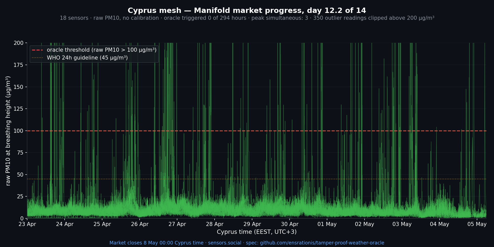

# Day 12 of 14 — status update (2 days to close)

*2026-05-05 · live demo market: <https://manifold.markets/SergeiLonshakov/will-the-robonomicspowered-citizen>*

## Numbers (per spec — frozen pool)

The qualified pool was frozen at market open at **19 sensors** (per the market description; new sensors that joined during the window do not affect resolution). The frozen pool is committed in [`data/cyprus_oracle_qualified_pool.json`](../data/cyprus_oracle_qualified_pool.json) for audit.

- **Frozen qualified pool**: 19 sensors
- **Of which reported in window**: 18 (one sensor was offline for the entire 12 days)
- **Oracle-triggered hours so far**: **0**
- **Peak simultaneous over-threshold (>100 µg/m³)**: **3 of 19** sensors — well under the quorum of 10
- **Days elapsed**: 12 of 14 · **days remaining**: ~2 (close 2026-05-07 21:00 UTC)

The network has now spent 12 consecutive days without any 1-hour window in which 10 of the original 19 sensors crossed the threshold simultaneously.

> Note on previous updates: Day 3 and Day 9 updates reported "21" and "22" sensors respectively — that was the count of all PM10-reporting sensors in Cyprus at the time, including new devices that joined after market open. Per spec, only the **frozen pool of 19** is what counts toward resolution. The triggered-hour and peak-simultaneous numbers are unchanged.

## Notable atmospheric event — but the *opposite* of what the market is about

Overnight 3→4 May, a strong south-westerly wind storm passed over Cyprus:

- Peak gust **103 km/h around 05:00 local time**, sustained 30–35 km/h for hours
- **15.8 mm of rain** in 24 hours
- Wind was south-westerly = **clean ocean air** (not dust-bearing southerlies)

This is exactly the inverse of a dust event — the storm *washed out* whatever Saharan haze had been sitting in the column. Ground network registered the cleanest hourly medians of the entire window in the hours after.

## CAMS satellite forecast through market close

For the remaining ~63 hours until close (2026-05-07 21:00 UTC):

- **AOD**: 0.09 – 0.17 (clear sky / mild haze)
- **Surface PM10 forecast**: 4 – 7 µg/m³
- **Dust component**: 0 µg/m³ — no dust signal in the model
- **Hours with CAMS surface PM10 > 100 µg/m³**: **0**

CAMS does not predict a dust event in the remaining window. The independent ground network agrees — current conditions are post-washout, baseline very low.

## Reference

| Storm | Window | Triggered hours | Peak simultaneous |
|---|---|---|---|
| Storm 1 | 14–16 Apr (pre-market) | 0 | 7 |
| Storm 2 | 17–19 Apr (pre-market) | 6 (all 18 Apr) | 14 (74 % of pool) |
| Wind/rain storm | 3–4 May | 0 (anti-dust event) | — |
| **Market window total** | **23 Apr → today** | **0** | 3 |

For YES to resolve, a Storm-2-class event needs to land in the next ~48 hours despite a CAMS forecast that explicitly rules it out. Possible but increasingly improbable.

Spec: [`spec.md`](../spec.md). Frozen pool: [`data/cyprus_oracle_qualified_pool.json`](../data/cyprus_oracle_qualified_pool.json). Previous updates: [Day 3](2026-04-26.md) · [Day 9](2026-05-02.md).
