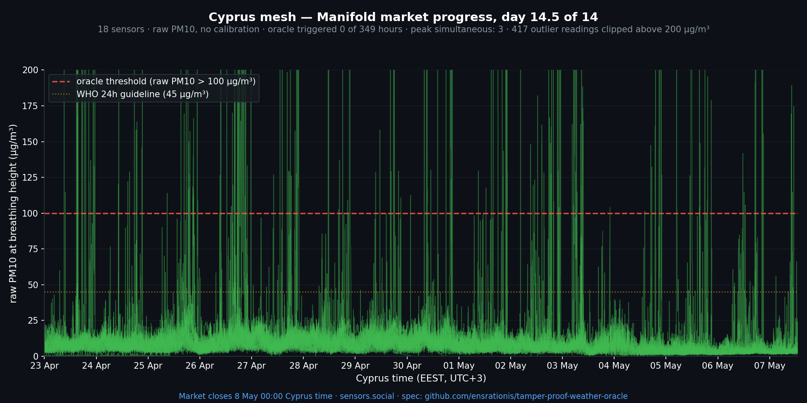

# Final report — 14 of 14 days · market closing in ~8 hours

*2026-05-07 · live demo market: <https://manifold.markets/SergeiLonshakov/will-the-robonomicspowered-citizen> · close 21:00 UTC*

## Final numbers (frozen pool)

- **Qualified pool**: 19 sensors (frozen at market open; see [data/cyprus_oracle_qualified_pool.json](../data/cyprus_oracle_qualified_pool.json))
- **Of which reported during the 14 days**: 18
- **Total observation hours**: 349 (market window 23 Apr 00:00 → 7 May 21:00 UTC; ~8 h remain at the time of writing)
- **Oracle-triggered hours**: **0**
- **Peak simultaneous over-threshold (raw PM10 > 100 µg/m³)**: **3 of 19 sensors** — reached on 4 separate hours, never higher than 3
- **CAMS forecast for the remaining ~8 h**: surface PM10 4–7 µg/m³, dust 0, hours over 100 → **0**

The oracle has not registered a single hour where 10 of the 19 frozen sensors crossed the threshold simultaneously. Resolution is effectively locked at **NO** unless something physically impossible happens before 21:00 UTC tonight.

## Top 5 hours by simultaneous over-threshold count

| Hour (UTC) | Sensors over 100 µg/m³ |
|---|---|
| 23 Apr 15:00 | 3 of 19 |
| 26 Apr 16:00 | 3 of 19 |
| 27 Apr 17:00 | 3 of 19 |
| 02 May 18:00 | 3 of 19 |
| 23 Apr 17:00 | 2 of 19 |

The quorum threshold is **10**. The peak observation reached **30 %** of that. None of these were dust events — they were ordinary mid-afternoon spikes from local sources (cooking, BBQ, traffic), and they never coincided across more than 3 devices.

## Comparison with pre-market storms

| Storm | Window | Triggered hours | Peak simultaneous |
|---|---|---|---|
| Storm 1 | 14–16 Apr (pre-market) | 0 | 7 of 19 |
| Storm 2 | 17–19 Apr (pre-market) | 6 (all 18 Apr) | 14 of 19 (74 %) |
| Wind/rain washout | 3–4 May | 0 (anti-dust) | — |
| **Market window** | **23 Apr → 7 May** | **0** | **3 of 19** |

The pre-market period gave the oracle one hard positive (Storm 2 — clean basin-wide trigger) and one near-miss (Storm 1 — 7 of 19, missed quorum). The market window itself produced neither — just calm spring weather, a couple of localised cooking smoke peaks, and one rinsing rain storm.

## What the experiment demonstrated

1. **The trigger rule discriminates.** Storm 1 (real but localised) failed quorum at 7/19; Storm 2 (basin-wide) cleared it at 14/19; the market window (no event) never exceeded 3/19. Each kind of weather got the answer it deserved.
2. **The threshold is well-calibrated.** "10 of 19 sensors > 100 µg/m³ within one hour" gave neither false positives during ordinary cooking-smoke spikes (peak 3/19) nor false negatives during a real storm (Storm 2 cleared by a wide margin).
3. **CAMS satellite forecast and ground network agree on baseline.** During the entire market window, both the CAMS surface PM10 model and the citizen sensor network reported clean to mildly hazy conditions. Snapshots of CAMS forecasts taken weekly are committed in the operator's working repo for retrospective accuracy analysis.
4. **A single-sensor attack would not move the oracle.** The two known noisy sensors in the pool (`4DjaKwvFCG…` — balcony smoker; `4Et69cDhnvUqws…` — restaurant kitchen nearby) regularly logged readings 100–400+. Including them, the network still never reached more than 3 of 19 simultaneously over threshold. To force a YES dishonestly, an attacker needs ~10 simultaneous personal sources, owned by ~10 different operators, distributed across the island. Not feasible.

## Cost of running the experiment

The oracle pipeline ran on existing sensors.social infrastructure (citizen-owned hardware, Robonomics IPCI relayers, MongoDB indexer). No new infrastructure was added for this market. Marginal cost over the 14 days: 0.

## Next

The repo and spec stay live. We will run the same trigger rule retroactively on any future Cyprus dust event to keep building a sensitivity profile. Comments / questions / "we'd like to integrate this for our own market" → open an issue.

---

Spec: [`spec.md`](../spec.md). Frozen pool: [`data/cyprus_oracle_qualified_pool.json`](../data/cyprus_oracle_qualified_pool.json). Previous updates: [Day 3](2026-04-26.md) · [Day 9](2026-05-02.md) · [Day 12](2026-05-05.md).
